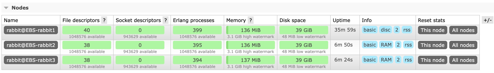
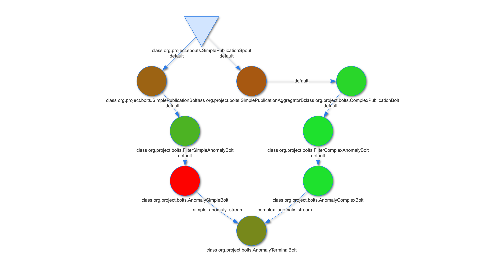

Table of Contents
- [Project (short-description)](#project-short-description)
  - [Tasks](#tasks)
  - [Bonus](#bonus)
  - [Note](#note)
- [Setup](#setup)
  - [Local Build](#local-build)
  - [Docker](#docker)
    - [What is a container?](#what-is-a-container)
    - [What is a container image?](#what-is-a-container-image)
    - [Docker Storm Image](#docker-storm-image)
    - [Setting up a minimal Storm cluster](#setting-up-a-minimal-storm-cluster)
    - [Integration with the docker image](#integration-with-the-docker-image)
  - [Integration with Storm UI](#integration-with-storm-ui)
  - [Custom metrics](#custom-metrics)
    - [Graphite](#graphite)
    - [Graphite integration with JAVA and Apache Storm](#graphite-integration-with-java-and-apache-storm)
    - [Graphite with Docker](#graphite-with-docker)
- [Implementation](#implementation)
  - [Protobuf](#protobuf)
  - [Simple publication](#simple-publication)
  - [Complex Publication](#complex-publication)
  - [Simple Subscription](#simple-subscription)
  - [Complex Subscription](#complex-subscription)
  - [Filters](#filters)
  - [Brokers](#brokers)
    - [RabbitMQ](#rabbitmq)
  - [Topology Diagram](#topology-diagram)
  - [Assignment breakdown](#assignment-breakdown)
    - [(5p) Publications stream](#5p-publications-stream)
    - [(10p) Network of brokers (2-3), content-based filtering \& publication windows](#10p-network-of-brokers-2-3-content-based-filtering--publication-windows)
    - [(5p) Subscriber nodes (simple \& complex subscriptions)](#5p-subscriber-nodes-simple--complex-subscriptions)
    - [(5p) Binary serialization mechanism](#5p-binary-serialization-mechanism)
    - [(10p) Sistem evaluation (10000 simple subscriptions)](#10p-sistem-evaluation-10000-simple-subscriptions)
  - [References](#references)

# Project (short-description)
Implementati o arhitectura de sistem publish/subscribe, content-based, care sa fie capabila sa proceseze si secvente de publicatii grupate in ferestre, structurata in felul descris in Tasks.

## Tasks
- (5p) Generati un flux de publicatii care sa fie emis de un nod publisher. Publicatiile pot fi generate cu valori aleatoare pentru campuri folosind generatorul de date din tema practica.
- (10p) Implementati o retea (overlay) de brokeri (2-3) care sa notifice clienti (subscriberi) in functie de o filtrare bazata pe continutul publicatiilor, cu posibilitatea de a procesa inclusiv ferestre (secvente) de publicatii (exemplu mai jos).

  https://storm.apache.org/releases/2.4.0/Windowing.html    

- (5p) Simulati 3 noduri subscriber care se conecteaza la reteaua de brokeri si pot inregistra atat susbcriptii simple cat si subscriptii complexe ce necesita o filtrare pe fereastra de publicatii. Subscriptiile pot fi generate cu valori aleatoare pentru campuri folosind generatorul de date din tema practica, modificat pentru a genera si subscriptii pentru ferestre de publicatii (exemplu mai jos).
- (5p) Folositi un mecanism de serializare binara (exemplu - Google Protocol Buffers sau Thrift) pentru transmiterea publicatiilor de la nodul publisher la brokers.
- (10p) Realizati o evaluare a sistemului, masurand pentru inregistrarea a 10000 de subscriptii simple, urmatoarele statistici: a) cate publicatii se livreaza cu succes prin reteaua de brokeri intr-un interval continuu de feed de 3 minute, b) latenta medie de livrare a unei publicatii (timpul de la emitere pana la primire) pentru publicatiile trimise in acelasi interval, c) rata de potrivire (matching) pentru cazul in care subscriptiile generate contin pe unul dintre campuri doar operator de egalitate (100%) comparata cu situatia in care frecventa operatorului de egalitate pe campul respectiv este aproximativ un sfert (25%). Redactati un scurt raport de evaluare a solutiei.

    

        Exemple
    

    Exemplu filtrare subscriptii simple si subscriptii complexe (cu filtrare pe fereastra de publicatii):
    
    Subscriptie simpla: {(city,=,"Bucharest");(temp,>=,10);(wind,<,11)}
    In acest caz un subscriber va fi notificat cu toate publicatiile care au o potrivire pozitiva evaluata prin simpla comparatie a campurilor corespondente din subscriptie si publicatie.
    
    Subscriptie complexa: {(city,=,"Bucharest");(avg_temp,>,8.5);(avg_wind,<=,13)}
    Campurile "avg_" indica in exemplu un criteriu de medie pe o fereastra de publicatii. 
    Se va considera o dimensiune fixa a ferestrei ce va fi determinata pe baza unui contor de publicatii. 
    Dimensiunea ferestrea va fi data ca parametru de configurare a sistemului (ex. 10 publicatii pe fereastra). 
    Un subscriber va fi notificat printr-un mesaj specific in momentul in care apare o fereastra de publicatii in fluxul generat care va avea o potrivire cu respectivul criteriu. 
    In exemplul dat, cand ultimele 10 publicatii care redau starea meteo din Bucuresti au mediile de temperatura si vant dorite de un subscriber, i se va trimite un mesaj de notificare special de tip "meta-publicatie": {(city,=,"Bucharest");(conditions,=,true)}. 
    Se cere implementarea a cel putin un criteriu de procesare pe fereastra pentru un camp. 
    Criteriul poate fi la alegere (medie, maxim, etc.) iar modul de avans al ferestrei va fi tumbling window (fiecare fereastra va urma distinct in succesiune celei anterioare dupa completarea numarului de publicatii care o compun). 
    Nu se cere tratarea situatiilor de inordine a publicatiilor dintr-o fereastra.

## Bonus

- (5p) Implementati un mecanism avansat de rutare la inregistrarea subscriptiilor simple ce ar trebui sa fie distribuite in reteaua de brokeri (publicatiile vor trece prin mai multi brokeri pana la destinatie, fiecare ocupandu-se partial de rutare, si nu doar unul care contine toate subscriptiile si face un simplu match).
- (5p) Simulati si tratati (prin asigurare de suport in implementare) cazuri de caderi pe nodurile broker, care sa asigure ca nu se pierd notificari, inclusiv pentru cazul subscriptiilor complexe.
- (5-10p) Implementati o modalitate de filtrare a mesajelor care sa nu permita brokerilor accesul la continutul mesajelor (match pe subscriptii/publicatii criptate).

## Note
- Proiectul poate fi realizat in echipe de pana la 3 studenti si va fi prezentat la o data ce va fi stabilita in perioada de sesiune.
- Proiectul poate fi implementat utilizand orice limbaj sau platforma. In cazul in care se va folosi Apache Kafka in implementare, utilizarea acestei platforme va fi limitata doar pentru livrarea mesajelor, asigurandu-se conectarea cu implementarea ce va folosi o alta solutie pentru partea efectiva de serviciu de procesare a datelor (filtrarea bazata pe continut, stocare subscriptii, etc).
- Nodurile distincte (publisher, subscribers, brokers) pot fi simulate de exemplu prin procese separate rulate pe acelasi sistem.

# Setup

## Local Build

I had some problems using:

    brew install zookeper

I used instead:
    
    brew install kafka
That brings zookeper as its bundled dependency.

Then you modify with the required settings:

    /opt/homebrew/etc/kafka/zookeeper.properties

Properties were taken from laboratory [website](https://profs.info.uaic.ro/~eonica/ebs/lab10.html).

    tickTime = 2000
    dataDir = /data/zookeeper
    clientPort = 2181 	   //default - 2181 - indica portul pentru clienti
    initLimit = 5
    syncLimit = 2
    admin.serverPort = 8089    //default - 8080 - indica portul unui serviciu de administrare

And they were adjusted accordingly (paths).

Start Zookeeper

    sudo zookeeper-server-start /opt/homebrew/etc/kafka/zookeeper.properties

Check Zookeper

    /opt/homebrew/Cellar/kafka/3.4.0/libexec/bin/zookeeper-shell.sh 127.0.0.1:2181 

Installing storm:

    brew install storm

And then running it:

    storm nimbus

And we got the following:

    java.lang.Error: java.lang.UnsatisfiedLinkError: /private/var/folders/ws/55x5my290nx65byh81rbwkxm0000gn/T/librocksdbjni6853774715399087171.jnilib: dlopen(/private/var/folders/ws/55x5my290nx65byh81rbwkxm0000gn/T/librocksdbjni6853774715399087171.jnilib, 0x0001): tried    : '/private/var/folders/ws/55x5my290nx65byh81rbwkxm0000gn/T/librocksdbjni6853774715399087171.jnilib' (mach-o file, but is an incompatible architecture (have 'x86_64', need 'arm64')), '/System/Volumes/Preboot/Cryptexes/OS/private/var/folders/ws/55x5my290nx65byh81rbwk    xm0000gn/T/librocksdbjni6853774715399087171.jnilib' (no such file), '/private/var/folders/ws/55x5my290nx65byh81rbwkxm0000gn/T/librocksdbjni6853774715399087171.jnilib' (mach-o file, but is an incompatible architecture (have 'x86_64', need 'arm64'))

Thus.. we might not be able to run this unless we manually bump up rocksdb dependency to include ARM64 binaries.

    https://github.com/facebook/rocksdb/issues/7720
    
    RocksDB 6.29.4.1 has been released to Maven Central which should now work on M1 macs.
    Changelog: https://github.com/facebook/rocksdb/releases/tag/v6.29.3

## Docker

[Docker Desktop](https://docs.docker.com/desktop/) is a one-click-install application for your Mac, Linux, or Windows environment that enables you to build and share containerized applications and microservices.

It provides a straightforward GUI (Graphical User Interface) that lets you manage your containers, applications, and images directly from your machine. Docker Desktop can be used either on it’s own or as a complementary tool to the CLI.

### What is a container?
Simply put, a container is another process on your machine that has been isolated from all other processes on the host machine. That isolation leverages kernel namespaces and cgroups, features that have been in Linux for a long time. Docker has worked to make these capabilities approachable and easy to use.

### What is a container image?
When running a container, it uses an isolated filesystem. This custom filesystem is provided by a container image. Since the image contains the container's filesystem, it must include everything needed to run the application - all dependencies, configuration, scripts, binaries, etc. The image also contains other configuration for the container, such as environment variables, a default command to run, and other metadata.

### Docker Storm Image

[Apache Storm](https://hub.docker.com/_/storm) is a free and open source distributed realtime computation system.

### Setting up a minimal Storm cluster

Start by creating a Docker network that will allow the two containers to communicate with each other. This network will act as a bridge between the containers:

    docker network create EBS

[Apache Zookeeper](https://zookeeper.apache.org) is a must for running a Storm cluster. Start it first. Since the Zookeeper "fails fast" it's better to always restart it.

    docker run -d --restart always --name EBS-zookeeper --network=EBS zookeeper

The Nimbus daemon has to be connected with the Zookeeper. It's also a "fail fast" system.

    docker run -d --restart always --name EBS-nimbus --network=EBS --link EBS-zookeeper:zookeeper storm storm nimbus

Finally start a single Supervisor node. It will talk to the Nimbus and Zookeeper.

    docker run -d --restart always --name EBS-supervisor --network=EBS --link EBS-zookeeper:zookeeper --link EBS-nimbus:nimbus storm storm supervisor

Now you can submit a topology to our cluster.

    docker run --link EBS-nimbus:nimbus --network=EBS -it --rm -v $(pwd)/topology.jar:/topology.jar storm storm jar /topology.jar org.project.Application project_topology

Optionally, you can start the Storm UI.

    docker run -d -p 8080:8080 --restart always --name EBS-Storm-UI --network=EBS --link EBS-nimbus:nimbus storm storm ui 

### Integration with the docker image

First run of a topology:

    ╰─ docker run --link some-nimbus:nimbus -it --rm -v $(pwd)/FinalProject.jar:/topology.jar storm storm jar /topology.jar org.project.Application project_topology                                                                                                           ─╯
    SLF4J: Class path contains multiple SLF4J bindings.
    SLF4J: Found binding in [jar:file:/apache-storm-2.4.0/lib/log4j-slf4j-impl-2.17.1.jar!/org/slf4j/impl/StaticLoggerBinder.class]
    SLF4J: Found binding in [jar:file:/topology.jar!/org/slf4j/impl/StaticLoggerBinder.class]
    SLF4J: See http://www.slf4j.org/codes.html#multiple_bindings for an explanation.
    SLF4J: Actual binding is of type [org.apache.logging.slf4j.Log4jLoggerFactory]
    Exception in thread "main" java.lang.ExceptionInInitializerError
	    at org.apache.storm.command.ConfigValue.main(ConfigValue.java:38)
    Caused by: java.lang.RuntimeException: java.io.IOException: Found multiple defaults.yaml resources. You're probably bundling the Storm jars with your topology jar. [jar:file:/apache-storm-2.4.0/lib/storm-client-2.4.0.jar!/defaults.yaml, jar:file:/topology.jar!/defaults.yaml]
	    at org.apache.storm.utils.Utils.findAndReadConfigFile(Utils.java:198)
	    at org.apache.storm.utils.Utils.readDefaultConfig(Utils.java:241)
	    at org.apache.storm.utils.Utils.readStormConfig(Utils.java:304)
	    at org.apache.storm.utils.Utils.<clinit>(Utils.java:132)
	    ... 1 more
    Caused by: java.io.IOException: Found multiple defaults.yaml resources. You're probably bundling the Storm jars with your topology jar. [jar:file:/apache-storm-2.4.0/lib/storm-client-2.4.0.jar!/defaults.yaml, jar:file:/topology.jar!/defaults.yaml]
	    at org.apache.storm.utils.Utils.getConfigFileInputStream(Utils.java:228)
	    at org.apache.storm.utils.Utils.findAndReadConfigFile(Utils.java:176)
	    ... 4 more
    Running: /opt/java/openjdk/bin/java -client -Ddaemon.name= -Dstorm.options= -Dstorm.home=/apache-storm-2.4.0 -Dstorm.log.dir=/logs -Djava.library.path= -Dstorm.conf.file= -cp /apache-storm-2.4.0/*:/apache-storm-2.4.0/lib-worker/*:/apache-storm-2.4.0/extlib/*:/topology.jar:/conf:/apache-storm-2.4.0/bin: -Dstorm.jar=/topology.jar -Dstorm.dependency.jars= -Dstorm.dependency.artifacts={} org.project.Application project_topology
    Error: LinkageError occurred while loading main class org.project.Application
	    java.lang.UnsupportedClassVersionError: org/project/Application has been compiled by a more recent version of the Java Runtime (class file version 63.0), this version of the Java Runtime only recognizes class file versions up to 55.0

Second run, building only the runtime artifacts:

    ╰─ docker run --link some-nimbus:nimbus -it --rm -v $(pwd)/topology.jar:/topology.jar storm storm jar /topology.jar org.project.Application                                                                                                                                ─╯
    Running: /opt/java/openjdk/bin/java -client -Ddaemon.name= -Dstorm.options= -Dstorm.home=/apache-storm-2.4.0 -Dstorm.log.dir=/logs -Djava.library.path=/usr/local/lib:/opt/local/lib:/usr/lib:/usr/lib64 -Dstorm.conf.file= -cp /apache-storm-2.4.0/*:/apache-storm-2.4.0/lib-worker/*:/apache-storm-2.4.0/extlib/*:/topology.jar:/conf:/apache-storm-2.4.0/bin: -Dstorm.jar=/topology.jar -Dstorm.dependency.jars= -Dstorm.dependency.artifacts={} org.project.Application
    Error: LinkageError occurred while loading main class org.project.Application
	    java.lang.UnsupportedClassVersionError: org/project/Application has been compiled by a more recent version of the Java Runtime (class file version 63.0), this version of the Java Runtime only recognizes class file versions up to 55.0

This basically says that this container supports at most Java 11.

After modifying JDK & JRE to 11, I moved to remove the LocalCluster approach I have been previously using in my code to a simple Topology that will be submitted to a running cluster - [example](https://github.com/apache/storm/blob/master/examples/storm-starter/src/jvm/org/apache/storm/starter/WordCountTopology.java) - and I finally got this:

    docker run --link some-nimbus:nimbus -it --rm -v $(pwd)/topology.jar:/topology.jar storm storm jar /topology.jar org.project.Application project_topology                                                              

    Running: /opt/java/openjdk/bin/java -client -Ddaemon.name= -Dstorm.options= -Dstorm.home=/apache-storm-2.4.0 -Dstorm.log.dir=/logs -Djava.library.path=/usr/local/lib:/opt/local/lib:/usr/lib:/usr/lib64 -Dstorm.conf.file= -cp /apache-storm-2.4.0/*:/apache-storm-2.4.0/lib-worker/*:/apache-storm-2.4.0/extlib/*:/topology.jar:/conf:/apache-storm-2.4.0/bin: -Dstorm.jar=/topology.jar -Dstorm.dependency.jars= -Dstorm.dependency.artifacts={} org.project.Application project_topology
    14:20:58.852 [main] INFO  o.a.s.StormSubmitter - Generated ZooKeeper secret payload for MD5-digest: -4779487961986633535:-5425152393008016990
    14:20:58.892 [main] INFO  o.a.s.u.NimbusClient - Found leader nimbus : d0883c921d10:6627
    14:20:58.893 [main] INFO  o.a.s.s.a.ClientAuthUtils - Got AutoCreds []
    14:20:58.910 [main] INFO  o.a.s.StormSubmitter - Uploading dependencies - jars...
    14:20:58.910 [main] INFO  o.a.s.StormSubmitter - Uploading dependencies - artifacts...
    14:20:58.910 [main] INFO  o.a.s.StormSubmitter - Dependency Blob keys - jars : [] / artifacts : []
    14:20:58.915 [main] INFO  o.a.s.StormSubmitter - Uploading topology jar /topology.jar to assigned location: /data/nimbus/inbox/stormjar-77e87dea-05d0-498c-bf78-826282196713.jar
    14:20:58.939 [main] INFO  o.a.s.StormSubmitter - Successfully uploaded topology jar to assigned location: /data/nimbus/inbox/stormjar-77e87dea-05d0-498c-bf78-826282196713.jar
    14:20:58.940 [main] INFO  o.a.s.StormSubmitter - Submitting topology project_topology in distributed mode with conf {"topology.transfer.batch.size":10,"topology.producer.batch.size":10,"storm.zookeeper.topology.auth.scheme":"digest","topology.stats.sample.rate":0.001,"topology.workers":1,"topology.debug":true,"storm.zookeeper.topology.auth.payload":"-4779487961986633535:-5425152393008016990","topology.executor.receive.buffer.size":1024}
    14:20:59.006 [main] INFO  o.a.s.StormSubmitter - Finished submitting topology: project_topology

But this was not enough. Using Storm UI, we checked our topology and we've found this:

    java.lang.RuntimeException: java.lang.NoClassDefFoundError: com/google/protobuf/MessageOrBuilder
	at org.apache.storm.utils.Utils$1.run(Utils.java:411)
	at java.base/java.lang.Thread.run(Unknown Source)

We killed the topology, added dependencies and tried again:

    SUCCESS!

## Integration with Storm UI

You cannot have spaces in your bolt IDs!! If you use:

    public static final String ID = ComplexPublicationSpout.class.toString();
as your class ID you'll get something like this:

    http://localhost:8080/component.html?id=class+org.project.spouts.fromAMQP.ComplexPublicationSpout&topology_id=weather-topology-9-1686396870

If you look closely, there's a class+name there. This crashes the page:

    org.apache.storm.thrift.TApplicationException: Internal error processing getComponentPageInfo
	at org.apache.storm.thrift.TServiceClient.receiveBase(TServiceClient.java:79)
	at org.apache.storm.generated.Nimbus$Client.recv_getComponentPageInfo(Nimbus.java:1521)
	at org.apache.storm.generated.Nimbus$Client.getComponentPageInfo(Nimbus.java:1505)
	at org.apache.storm.daemon.ui.UIHelpers.getComponentPage(UIHelpers.java:2082)
	at org.apache.storm.daemon.ui.resources.StormApiResource.getTopologyComponent(StormApiResource.java:428)
	at jdk.internal.reflect.GeneratedMethodAccessor33.invoke(Unknown Source)
	at java.base/jdk.internal.reflect.DelegatingMethodAccessorImpl.invoke(Unknown Source)
	at java.base/java.lang.reflect.Method.invoke(Unknown Source)
	at org.glassfish.jersey.server.model.internal.ResourceMethodInvocationHandlerFactory.lambda$static$0(ResourceMethodInvocationHandlerFactory.java:52)
	at org.glassfish.jersey.server.model.internal.AbstractJavaResourceMethodDispatcher$1.run(AbstractJavaResourceMethodDispatcher.java:124)
	at org.glassfish.jersey.server.model.internal.AbstractJavaResourceMethodDispatcher.invoke(AbstractJavaResourceMethodDispatcher.java:167)
	at org.glassfish.jersey.server.model.internal.JavaResourceMethodDispatcherProvider$ResponseOutInvoker.doDispatch(JavaResourceMethodDispatcherProvider.java:176)
	at org.glassfish.jersey.server.model.internal.AbstractJavaResourceMethodDispatcher.dispatch(AbstractJavaResourceMethodDispatcher.java:79)
	at org.glassfish.jersey.server.model.ResourceMethodInvoker.invoke(ResourceMethodInvoker.java:469)
	at org.glassfish.jersey.server.model.ResourceMethodInvoker.apply(ResourceMethodInvoker.java:391)
	at org.glassfish.jersey.server.model.ResourceMethodInvoker.apply(ResourceMethodInvoker.java:80)
	at org.glassfish.jersey.server.ServerRuntime$1.run(ServerRuntime.java:253)
	at org.glassfish.jersey.internal.Errors$1.call(Errors.java:248)
	at org.glassfish.jersey.internal.Errors$1.call(Errors.java:244)
	at org.glassfish.jersey.internal.Errors.process(Errors.java:292)
	at org.glassfish.jersey.internal.Errors.process(Errors.java:274)
	at org.glassfish.jersey.internal.Errors.process(Errors.java:244)
	at org.glassfish.jersey.process.internal.RequestScope.runInScope(RequestScope.java:265)
	at org.glassfish.jersey.server.ServerRuntime.process(ServerRuntime.java:232)
	at org.glassfish.jersey.server.ApplicationHandler.handle(ApplicationHandler.java:680)
	at org.glassfish.jersey.servlet.WebComponent.serviceImpl(WebComponent.java:392)
	at org.glassfish.jersey.servlet.WebComponent.service(WebComponent.java:346)
	at org.glassfish.jersey.servlet.ServletContainer.service(ServletContainer.java:365)
	at org.glassfish.jersey.servlet.ServletContainer.service(ServletContainer.java:318)
	at org.glassfish.jersey.servlet.ServletContainer.service(ServletContainer.java:205)
	at org.eclipse.jetty.servlet.ServletHolder.handle(ServletHolder.java:867)
	at org.eclipse.jetty.servlet.ServletHandler$CachedChain.doFilter(ServletHandler.java:1623)
	at org.apache.storm.daemon.ui.filters.HeaderResponseServletFilter.doFilter(HeaderResponseServletFilter.java:62)
	at org.eclipse.jetty.servlet.ServletHandler$CachedChain.doFilter(ServletHandler.java:1610)
	at org.apache.storm.daemon.drpc.webapp.ReqContextFilter.handle(ReqContextFilter.java:83)
	at org.apache.storm.daemon.drpc.webapp.ReqContextFilter.doFilter(ReqContextFilter.java:70)
	at org.eclipse.jetty.servlet.ServletHandler$CachedChain.doFilter(ServletHandler.java:1610)
	at org.apache.storm.logging.filters.AccessLoggingFilter.handle(AccessLoggingFilter.java:46)
	at org.apache.storm.logging.filters.AccessLoggingFilter.doFilter(AccessLoggingFilter.java:38)
	at org.eclipse.jetty.servlet.ServletHandler$CachedChain.doFilter(ServletHandler.java:1610)
	at org.eclipse.jetty.servlets.CrossOriginFilter.handle(CrossOriginFilter.java:311)
	at org.eclipse.jetty.servlets.CrossOriginFilter.doFilter(CrossOriginFilter.java:265)
	at org.eclipse.jetty.servlet.ServletHandler$CachedChain.doFilter(ServletHandler.java:1610)
	at org.eclipse.jetty.servlet.ServletHandler.doHandle(ServletHandler.java:540)
	at org.eclipse.jetty.server.handler.ScopedHandler.nextHandle(ScopedHandler.java:255)
	at org.eclipse.jetty.server.session.SessionHandler.doHandle(SessionHandler.java:1588)
	at org.eclipse.jetty.server.handler.ScopedHandler.nextHandle(ScopedHandler.java:255)
	at org.eclipse.jetty.server.handler.ContextHandler.doHandle(ContextHandler.java:1345)
	at org.eclipse.jetty.server.handler.ScopedHandler.nextScope(ScopedHandler.java:203)
	at org.eclipse.jetty.servlet.ServletHandler.doScope(ServletHandler.java:480)
	at org.eclipse.jetty.server.session.SessionHandler.doScope(SessionHandler.java:1557)
	at org.eclipse.jetty.server.handler.ScopedHandler.nextScope(ScopedHandler.java:201)
	at org.eclipse.jetty.server.handler.ContextHandler.doScope(ContextHandler.java:1247)
	at org.eclipse.jetty.server.handler.ScopedHandler.handle(ScopedHandler.java:144)
	at org.eclipse.jetty.server.handler.HandlerWrapper.handle(HandlerWrapper.java:132)
	at org.eclipse.jetty.server.Server.handle(Server.java:502)
	at org.eclipse.jetty.server.HttpChannel.handle(HttpChannel.java:364)
	at org.eclipse.jetty.server.HttpConnection.onFillable(HttpConnection.java:260)
	at org.eclipse.jetty.io.AbstractConnection$ReadCallback.succeeded(AbstractConnection.java:305)
	at org.eclipse.jetty.io.FillInterest.fillable(FillInterest.java:103)
	at org.eclipse.jetty.io.ChannelEndPoint$2.run(ChannelEndPoint.java:118)
	at org.eclipse.jetty.util.thread.strategy.EatWhatYouKill.runTask(EatWhatYouKill.java:333)
	at org.eclipse.jetty.util.thread.strategy.EatWhatYouKill.doProduce(EatWhatYouKill.java:310)
	at org.eclipse.jetty.util.thread.strategy.EatWhatYouKill.tryProduce(EatWhatYouKill.java:168)
	at org.eclipse.jetty.util.thread.strategy.EatWhatYouKill.run(EatWhatYouKill.java:126)
	at org.eclipse.jetty.util.thread.ReservedThreadExecutor$ReservedThread.run(ReservedThreadExecutor.java:366)
	at org.eclipse.jetty.util.thread.QueuedThreadPool.runJob(QueuedThreadPool.java:765)
	at org.eclipse.jetty.util.thread.QueuedThreadPool$2.run(QueuedThreadPool.java:683)
	at java.base/java.lang.Thread.run(Unknown Source)

You can use:

    public static final String ID = SimplePublicationAggregatorBolt.class.getCanonicalName();

## Custom metrics

You can use Storm API:

    http://localhost:8080/api/v1/topology

and manually connect it to what you'd need.
But there are alternatives.

### Graphite

[Graphite](https://graphiteapp.org) is an open-source monitoring and graphing tool used for collecting, storing, and visualizing time-series data. It is designed to handle large volumes of time-series metrics and provides a flexible and scalable solution for monitoring and analyzing the performance of systems and applications.

Key components of Graphite include:

- Data Collection: Graphite can receive metrics data from various sources, such as applications, servers, network devices, and other monitoring systems. The data is typically collected using a protocol called "Carbon," which accepts data in a specific format (e.g., timestamp-value pairs).

- Storage: Graphite stores the incoming metrics data in a time-series database known as Whisper. Whisper is optimized for time-series data and provides efficient storage and retrieval of metrics over time.

- Query and Analysis: Graphite provides a query language called "Graphite Query Language" (GQL) that allows you to retrieve and analyze metrics data. GQL enables you to specify the time range, aggregation functions, and mathematical operations to perform on the metrics data.

- Visualization: Graphite offers a web-based interface called the Graphite Web App that allows you to create visualizations and graphs based on the queried metrics data. You can customize the graphs with various options, such as different chart types, colors, and legends.

### Graphite integration with JAVA and Apache Storm

    <!--- https://discuss.lightbend.com/t/error-missing-com-codahale-metrics-jmxreporter-class/3051/5 -->
    <dependency>
        <groupId>io.dropwizard.metrics</groupId>
        <artifactId>metrics-core</artifactId>
        <version>3.2.2</version>
    </dependency>

    <dependency>
        <groupId>io.dropwizard.metrics</groupId>
        <artifactId>metrics-graphite</artifactId>
        <version>4.2.17</version>
    </dependency>

Once you added the required dependencies, you can just set it up as it follows:

    this.metricRegistry = new MetricRegistry();

    String graphiteHost = "localhost"; // Replace with the actual Graphite server hostname or IP
    int graphitePort = 2003; // Replace with the actual Graphite server port

    Graphite graphite = new Graphite(new InetSocketAddress(graphiteHost, graphitePort));
    GraphiteReporter reporter = GraphiteReporter.forRegistry(metricRegistry)
            .prefixedWith("ebs_final_project2.metrics") // Prefix for your metrics in Graphite
            .build(graphite);

    reporter.start(1, TimeUnit.SECONDS); // Configure the reporting interval (e.g., every 1 second)

### Graphite with Docker

For an instance that you can connect running a LocalCluster topology:

    docker run -d --name EBS-graphite --restart=always -p 80:80 -p 2003-2004:2003-2004 -p 2023-2024:2023-2024 -p 8125:8125/udp -p 8126:8126 graphiteapp/graphite-statsd

If you want it to add it into the project network you'd use:

    docker run -d --name EBS-graphite --network=EBS --restart=always -p 80:80 -p 2003-2004:2003-2004 -p 2023-2024:2023-2024 -p 8125:8125/udp -p 8126:8126 graphiteapp/graphite-statsd

# Implementation

## Protobuf

We are using the protoc command:

    protoc --java_out=<path> <filename.proto>
And this generates the required .java files that we'll be using in our project.

## Simple publication
    syntax = "proto3";

    option java_package = "org.project.models";
    option java_outer_classname = "ProtoSimplePublication";

    message SimplePublication {
        string uuid = 1;
        string station_id = 2;
        Location location = 3;
        string city = 4;
        double temperature = 5;
        double rain = 6;
        double wind = 7;
        string direction = 8;  
        int64 date_timestamp = 9;
        int64 generation_timestamp = 10;
    }

    message Location {
        double latitude = 1;
        double longitude = 2;
    }

- uuid: Unique identifier of the data.
- station_id: A string field for the unique identifier of the weather station.
- location - A message field containing latitude and longitude of the station.
- city: A string field for the city where the weather station is located.
- temperature: A double field for the current temperature reading in Celsius.
- rain: A double field for the current rain reading in millimeters.
- wind: A double field for the current wind speed reading in kilometers per hour.
- direction: A string field for the current wind direction reading.
- date_timestamp: An int64 field containing the timestamp when the data was generated.
- generation_timestamp: An int64 field containing the timestamp when data first reached the system.

## Complex Publication

    syntax = "proto3";

    option java_package = "org.project.models";
    option java_outer_classname = "ProtoComplexPublication";

    message ComplexPublication {
        string uuid = 1;
        string city = 2;
        Location location = 3;
        double avg_temperature = 4;
        double avg_rain = 5;
        double avg_wind = 6;
        int32 publications_count= 7;
        int64 timestamp = 8;
    }

    message Location {
        double latitude = 1;
        double longitude = 2;
    }

- uuid: Unique identifier of the data.
- city: This field is a string that represents the name of the city where the weather station is located.
- location: This field is a message type that contains the latitude and longitude coordinates of the weather station's location. It is defined by the Location message, which has two double fields named latitude and longitude.
- avg_temperature: This field is a double that represents the average temperature recorded by the weather station over a period of time, such as a day or a month.
- avg_rain: This field is a double that represents the average amount of rainfall recorded by the weather station over a period of time, such as a day or a month.
- avg_wind: This field is a double that represents the average wind speed recorded by the weather station over a period of time, such as a day or a month.
- publications_count: This field contains the number of simple publications this complex publication was generated based upon.
- timestamp: This field contains the timestamp this complex generation was created.

## Simple Subscription

    syntax = "proto3";

    option java_package = "org.project.models";
    option java_outer_classname = "ProtoSimpleSubscription";

    enum Operator {
        NONE = 0;
        LOWER_THAN = 1;
        EQUAL_OR_LOWER_THAN = 2;
        EQUAL = 3;
        EQUAL_OR_GREATER_THAN = 4;
        GREATER_THAN = 5;
    }

    message ConditionDouble {
        Operator operator = 1;
        double value = 2;
    }

    message ConditionString {
        Operator operator = 1;
        string value = 2;
    }

    message SimplePublicationCondition {
        ConditionString city = 1;
        ConditionDouble temperature = 2;
        ConditionDouble rain = 3;
        ConditionDouble wind = 4;
    }

    message SimpleSubscription {  
        string subscriberId = 1;
        string subscriptionId = 2;
        SimplePublicationCondition conditions = 3;
        int64 timestamp = 4;
    }

## Complex Subscription

    syntax = "proto3";

    option java_package = "org.project.models";
    option java_outer_classname = "ProtoComplexSubscription";

    enum Operator {
        NONE = 0;
        LOWER_THAN = 1;
        EQUAL_OR_LOWER_THAN = 2;
        EQUAL = 3;
        EQUAL_OR_GREATER_THAN = 4;
        GREATER_THAN = 5;
    }

    message ConditionDouble {
        Operator operator = 1;
        double value = 2;
    }

    message ConditionString {
        Operator operator = 1;
        string value = 2;
    }

    message ComplexPublicationCondition {
        ConditionString city = 1;
        ConditionDouble averageTemperature = 2;
        ConditionDouble averageRain = 3;
        ConditionDouble averageWind = 4;
    }

    message ComplexSubscription {
        string subscriberId = 1;
        string subscriptionId = 2;
        ComplexPublicationCondition conditions = 3;
        int64 timestamp = 4;
    }

## Filters
Filter implementation is made via bolts that filters out the unwanted publications.

First, a class that implements all the filters on the respective fields and operators is created (protobuf in simple & complex subscriptions):

    enum Operator {
        NONE = 0;
        LOWER_THAN = 1;
        EQUAL_OR_LOWER_THAN = 2;
        EQUAL = 3;
        EQUAL_OR_GREATER_THAN = 4;
        GREATER_THAN = 5;
    }

With a function example as it follows:

    public static Predicate<ProtoSimplePublication.SimplePublication> filterByTemperature(ProtoSimpleSubscription.Operator type, double temperature) {
        switch (type) {
            case NONE:
                return (sp) -> true;
            case LOWER_THAN:
                return (sp) -> sp.getTemperature() < temperature;
            case EQUAL_OR_LOWER_THAN:
                return (sp) -> sp.getTemperature() <= temperature;
            case EQUAL:
                return (sp) -> sp.getTemperature() == temperature;
            case EQUAL_OR_GREATER_THAN:
                return (sp) -> sp.getTemperature() >= temperature;
            case GREATER_THAN:
                return (sp) -> sp.getTemperature() > temperature;
            default:
                throw new IllegalArgumentException("Unknown operator!");
        }
    }

This gets passed to a Bolt. But it needs a serializable form in order to be serialized by [Kryo](https://github.com/EsotericSoftware/kryo) so I'm using lambda with a Serializable interface that call a static function from filter class:

    (Predicate<ProtoSimplePublication.SimplePublication> & Serializable) (n) ->
                                        SimplePublicationFilter.filterByCity(Operator.Type.EQUAL, "San Francisco").test(n)
                                
Everything is then put into a list and then passed to a Bolt:

    var filterSimpleAnomalyBolt =
                new FilterSimpleAnomalyBolt(
                        List.of(
                                (Predicate<ProtoSimplePublication.SimplePublication> & Serializable) (n) ->
                                        SimplePublicationFilter.composedFilter(
                                            List.of(SimplePublicationFilter.filterByTemperature(Operator.Type.GREATER_THAN, AnomalySimplePublication.MAX_TEMPERATURE))).test(n),
                                (Predicate<ProtoSimplePublication.SimplePublication> & Serializable) (n) ->
                                        SimplePublicationFilter.composedFilter(
                                            List.of(SimplePublicationFilter.filterByTemperature(Operator.Type.LOWER_THAN, AnomalySimplePublication.MIN_TEMPERATURE))).test(n),
                                (Predicate<ProtoSimplePublication.SimplePublication> & Serializable) (n) ->
                                        SimplePublicationFilter.composedFilter(
                                            List.of(SimplePublicationFilter.filterByWind(Operator.Type.GREATER_THAN, AnomalySimplePublication.MAX_WIND))).test(n),
                                (Predicate<ProtoSimplePublication.SimplePublication> & Serializable) (n) ->
                                        SimplePublicationFilter.composedFilter(
                                            List.of(SimplePublicationFilter.filterByRain(Operator.Type.GREATER_THAN, AnomalySimplePublication.MAX_RAIN))).test(n)
                        ));     

The bolt then uses a map reduce operation on the aforementioned list with the condition that if any of the combined filters (list of predicates where all must be true) tested is true then it emits the anomaly/filtered publication:

    @Override
    public void execute(Tuple input) {
        input.getFields().forEach((f) -> {
            var value = input.getValueByField(f);
            if (f.equals("SimplePublication")) {
                var sp = (ProtoSimplePublication.SimplePublication) (value);
                if (this.predicates.stream().map(p -> p.test(sp)).reduce(false, (a, b) -> a || b)) {
                    var anomalyType = AnomalySimplePublication.ToString(AnomalySimplePublication.isAnomaly(sp));
                    this.collector.emit(input, new Values(anomalyType, sp));
                } else {
                    LOG.info("Field <" + f + "> Value <" + sp + "> (Filtered!)");
                }
            } else {
                LOG.info("Field (Unknown!) <" + f + "> Value (Unknown!) <" + value + ">");
            }
        });

        this.collector.ack(input);
    }

These might be reduced as it follows:

    public static Predicate<ProtoSimplePublication.SimplePublication> composedFilter(List<Predicate<ProtoSimplePublication.SimplePublication>> predicates) {
        return predicates.stream().reduce(Predicate::and).orElse(sp -> true);
    }

We are also passing subscriptions (received in a bolt) to these type of predicates and testing publications matching as it follows:

    ...

    final private Map<String, List<ProtoSimpleSubscription.SimpleSubscription>> subscriptions = new HashMap<>();
   
    ...

    var sp = (ProtoSimplePublication.SimplePublication) value;

    List<String> subscribers = new ArrayList<>();
    subscriptions.forEach(
            (k, v) -> {
                var matched = v.stream().anyMatch((ss) -> SimplePublicationFilter.filter(ss).test(sp));
                if (matched) {
                    // LOG.info("Simple subscription matched!");
                    // LOG.info("Subscriber ID: " + k);
                    // LOG.info("Simple publication:\n " + sp);

                    subscribers.add(k);
                    if (publicationMatched.containsKey(k)) {
                         publicationMatched.put(k, publicationMatched.get(k) + 1);
                    } else {
                            publicationMatched.put(k, 1);
                    }
                }
            }
    );

    if (!subscribers.isEmpty()) {
        collector.emit(input, new Values(subscribers, sp));
    }

    ...

## Brokers

### RabbitMQ

[RabbitMQ](https://hub.docker.com/_/rabbitmq) is open source message broker software (sometimes called message-oriented middleware) that implements the Advanced Message Queuing Protocol (AMQP). The RabbitMQ server is written in the Erlang programming language and is built on the Open Telecom Platform framework for clustering and failover. Client libraries to interface with the broker are available for all major programming languages.

    docker pull rabbitmq
    docker run -d --hostname EBS-rabbit --name EBS-rabbit --network=EBS -p 9080:15672 -p 5672:5672 rabbitmq:3-management 

Careful not to collide with port 8080 used by Apache Storm UI.

Careful to expose port 5672 in order to be able to connect via AMQP.

This is a second set of tags provided with the [management plugin](https://www.rabbitmq.com/management.html) installed and enabled by default, which is available on the standard management port of 15672, with the default username and password of guest / guest.

We'd also like to develop and connect from the host so we don't specify any network:

    docker run -d --hostname EBS-rabbit --name EBS-local-rabbit -p 9081:15672 -p 5673:5672 rabbitmq:3-management

But we'd like a cluster to ensure that if a node crashes/fails, we have several replicas. Based on [this article](https://medium.com/@saurabh.singh0829/how-to-create-rabbitmq-cluster-in-docker-aws-linux-4b26a31f90bc) we configured our environment as it follows:

    docker run -d --hostname EBS-rabbit1 --name EBS-rabbit1 --network=EBS -p 9080:15672 -p 5672:5672 -e RABBITMQ_ERLANG_COOKIE='rabbitcookie' rabbitmq:3-management

    docker run -d --hostname EBS-rabbit2 --name EBS-rabbit2 --network=EBS -p 5674:5672 -e RABBITMQ_ERLANG_COOKIE='rabbitcookie' --link EBS-rabbit1:EBS-rabbit1 rabbitmq:3-management

    docker run -d --hostname EBS-rabbit3 --name EBS-rabbit3 --network=EBS -p 5675:5672 -e RABBITMQ_ERLANG_COOKIE='rabbitcookie' --link EBS-rabbit2:EBS-rabbit2 rabbitmq:3-management

And then we restarted everything in order to create the cluster:

    docker exec -it EBS-rabbit1 bash
    rabbitmqctl stop_app
    rabbitmqctl reset
    rabbitmqctl start_app

    docker exec -it EBS-rabbit2 bash
    rabbitmqctl stop_app
    rabbitmqctl reset
    rabbitmqctl join_cluster --ram rabbit@EBS-rabbit1
    rabbitmqctl start_app

    docker exec -it EBS-rabbit2 bash
    rabbitmqctl stop_app
    rabbitmqctl reset
    rabbitmqctl join_cluster --ram rabbit@EBS-rabbit1
    rabbitmqctl start_app

## Topology Diagram

## Assignment breakdown

### (5p) Publications stream

As seen in the [Topology Diagram](./docs/topology.png), there is a Storm spout (publisher node) that generates all the randomized sensor weather data. The java class spout is called `SimpleSubscriptionSpout.java`.

### (10p) Network of brokers (2-3), content-based filtering & publication windows

The brokers area is split between Apache Storm & RabbitMQ. The simple publication are passed to a bolt that aggregates data and based upon the configured window it creates complex publication. The simple & complex publications are then send to a RabbitMQ queue. Another Apache Storm spouts that connect to said queues will later match the clients with their subscriptions accordingly and send the publications (via RabbitMQ as well).

### (5p) Subscriber nodes (simple & complex subscriptions)

The subscribers "nodes" are simulated using an array of 3 UUIDs (in `SubscriptionGenerator` class) and then passed to every subscription (simple or complex) generated. The filters are lengthy described in their dedicated section in this document. The actual filtering on simple and complex publication is being done with Apache Storm bolts as well.

### (5p) Binary serialization mechanism

Google Protobuf (proto3 to be more specific) is used for binary serialization. It's usage & integration is lengthy explained in this document above.

### (10p) Sistem evaluation (10000 simple subscriptions)

- Publications successfully delivered through the broker network in a continuous 3-minutes feed interval

        TODO:

- The average delivery latency of a publication (the time from sending to receiving) for publications sent within the same interval

        TODO:

- The matching rate for the case when the generated subscriptions contain only an equality operator (100%) on one of the fields, compared to the situation where the frequency of the equality operator on that field is approximately one quarter (25%)

        TODO:

- Implement an advanced routing mechanism for registering simple subscriptions that should be distributed across the broker network (publications will pass through multiple brokers until reaching the destination, with each broker partially handling the routing, rather than a single broker containing all subscriptions and performing a simple match)
  
        TODO:

- Simulate and handle (by providing support in the implementation) cases of failures on broker nodes to ensure that no notifications are lost, including for complex subscriptions
- - There are multiple requirements here as we are using `Apache Storm` nodes along with `RabbitMQ` queues
- - For `Apache Storm` we are using `active replication`. There are at least `2 replicas` of each node used by our topologies. This ensures that if one fails, the we still have the other one. In the same time, the entire flow (routing) is being done by `ack` each input received. If we `fail` to ack an input that a bolt receives, that input will be `resent`.
- - For `RabbitMQ` we are using a built-in `ack` mechanism combined with the `Apache Storm` one. Each `Spout` based with `RabbitMQ` connection `ack` that it received the data and that it send it succesfully.
- - We also have a `cluster` of 3 instances for main `RabbitMQ` database using Docker.
  

- (5-10p) Implement a message filtering mechanism that does not allow brokers to access the content of messages (matching on encrypted subscriptions/publications)
    - Explored but `NOT IMPLEMENTED`. 
    - If there are multiple users who should receive the same publication and you want to encrypt the publication individually for each user, you can use a `hybrid encryption` approach in which you generate a `symmetric encryption key` for each publication and encrypt the publication with it.
    - Then, you encrypt the symmetric key with the `individual public keys` of each recipient.
    - `User-Specific Encryption Keys:` Each user should have a unique encryption key pair consisting of a public key and a private key. The private key should be securely stored and accessible only to the user, while the public key can be shared.
    - `Message Routing:` Define a message routing mechanism that allows you to route publications to multiple recipients. This can be achieved using routing keys, topics, or other routing mechanisms provided by your messaging system (e.g., RabbitMQ).
    - `Symmetric Key Generation:` For each publication, generate a random symmetric encryption key. This key will be used to encrypt the publication content.
    - Publication Encryption: When publishing a message, retrieve the list of intended recipients for that message based on its routing criteria. For each recipient, retrieve their corresponding public key. Encrypt the symmetric encryption key with the recipient's public key. Then, encrypt the publication content with the symmetric encryption key.
    - `Message Delivery:` Send the encrypted publications over the messaging system. The brokers will handle the routing and delivery of the encrypted publications to the appropriate recipients based on the routing criteria.
    - `Recipient Decryption:` Within each recipient's application code, retrieve the encrypted publications from the messaging system. For each publication, decrypt the symmetric encryption key using the recipient's private key. Then, decrypt the publication content using the decrypted symmetric encryption key.
    - By using a `hybrid encryption` approach, you can efficiently encrypt the publication content with a `symmetric encryption key` and protect the symmetric key itself by encrypting it individually for each recipient using their `public key`. This allows multiple users to receive the same publication while ensuring that each recipient can decrypt the publication content using their `private key`.

## References
https://www.tutorialspoint.com/apache_storm/apache_storm_quick_guide.htm

https://storm.apache.org/releases/2.4.0/Windowing.html

https://hub.docker.com/_/storm

https://github.com/apache/storm/blob/master/examples/storm-starter/src/jvm/org/apache/storm/starter/WordCountTopology.java

https://github.com/EsotericSoftware/kryo

https://hub.docker.com/_/rabbitmq

https://www.michael-noll.com/blog/2013/06/21/understanding-storm-internal-message-buffers

Initial code for the AMQP Spout has been taken from the book:

    Practical Real-time Data Processing and Analytics:
    Distributed Computing and Event Processing using Apache Spark, Flink, Storm, and Kafka
    by Shilpi Saxena, Saurabh Gupta

The code has been modified to suit the needs of this project. The book can be found [here](https://subscription.packtpub.com/book/data/9781787281202/6).

https://www.rabbitmq.com/tutorials/tutorial-seven-java.html

https://medium.com/@saurabh.singh0829/how-to-create-rabbitmq-cluster-in-docker-aws-linux-4b26a31f90bc