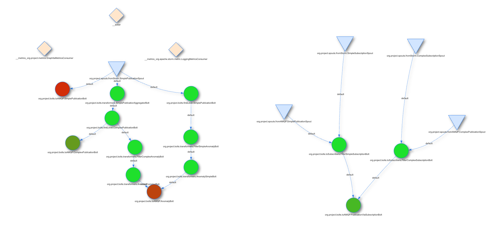

Table of Contents
- [Project (short-description)](#project-short-description)
  - [Tasks](#tasks)
  - [Bonus](#bonus)
  - [Note](#note)
- [Setup](#setup)
  - [Local Build](#local-build)
  - [Docker](#docker)
    - [What is a container?](#what-is-a-container)
    - [What is a container image?](#what-is-a-container-image)
    - [Docker Storm Image](#docker-storm-image)
    - [Setting up a minimal Storm cluster](#setting-up-a-minimal-storm-cluster)
    - [Integration with the docker image](#integration-with-the-docker-image)
- [Implementation](#implementation)
  - [Protobuf](#protobuf)
  - [Simple publication](#simple-publication)
  - [Complex Publication](#complex-publication)
  - [Simple Subscription](#simple-subscription)
  - [Complex Subscription](#complex-subscription)
  - [Filters](#filters)
  - [Topology Diagram](#topology-diagram)
  - [References](#references)

# Project (short-description)
Implementati o arhitectura de sistem publish/subscribe, content-based, care sa fie capabila sa proceseze si secvente de publicatii grupate in ferestre, structurata in felul descris in Tasks.

## Tasks
- (5p) Generati un flux de publicatii care sa fie emis de un nod publisher. Publicatiile pot fi generate cu valori aleatoare pentru campuri folosind generatorul de date din tema practica.
- (10p) Implementati o retea (overlay) de brokeri (2-3) care sa notifice clienti (subscriberi) in functie de o filtrare bazata pe continutul publicatiilor, cu posibilitatea de a procesa inclusiv ferestre (secvente) de publicatii (exemplu mai jos).

  https://storm.apache.org/releases/2.4.0/Windowing.html    

- (5p) Simulati 3 noduri subscriber care se conecteaza la reteaua de brokeri si pot inregistra atat susbcriptii simple cat si subscriptii complexe ce necesita o filtrare pe fereastra de publicatii. Subscriptiile pot fi generate cu valori aleatoare pentru campuri folosind generatorul de date din tema practica, modificat pentru a genera si subscriptii pentru ferestre de publicatii (exemplu mai jos).
- (5p) Folositi un mecanism de serializare binara (exemplu - Google Protocol Buffers sau Thrift) pentru transmiterea publicatiilor de la nodul publisher la brokers.
- (10p) Realizati o evaluare a sistemului, masurand pentru inregistrarea a 10000 de subscriptii simple, urmatoarele statistici: a) cate publicatii se livreaza cu succes prin reteaua de brokeri intr-un interval continuu de feed de 3 minute, b) latenta medie de livrare a unei publicatii (timpul de la emitere pana la primire) pentru publicatiile trimise in acelasi interval, c) rata de potrivire (matching) pentru cazul in care subscriptiile generate contin pe unul dintre campuri doar operator de egalitate (100%) comparata cu situatia in care frecventa operatorului de egalitate pe campul respectiv este aproximativ un sfert (25%). Redactati un scurt raport de evaluare a solutiei.

    

        Exemple
    

    Exemplu filtrare subscriptii simple si subscriptii complexe (cu filtrare pe fereastra de publicatii):
    
    Subscriptie simpla: {(city,=,"Bucharest");(temp,>=,10);(wind,<,11)}
    In acest caz un subscriber va fi notificat cu toate publicatiile care au o potrivire pozitiva evaluata prin simpla comparatie a campurilor corespondente din subscriptie si publicatie.
    
    Subscriptie complexa: {(city,=,"Bucharest");(avg_temp,>,8.5);(avg_wind,<=,13)}
    Campurile "avg_" indica in exemplu un criteriu de medie pe o fereastra de publicatii. 
    Se va considera o dimensiune fixa a ferestrei ce va fi determinata pe baza unui contor de publicatii. 
    Dimensiunea ferestrea va fi data ca parametru de configurare a sistemului (ex. 10 publicatii pe fereastra). 
    Un subscriber va fi notificat printr-un mesaj specific in momentul in care apare o fereastra de publicatii in fluxul generat care va avea o potrivire cu respectivul criteriu. 
    In exemplul dat, cand ultimele 10 publicatii care redau starea meteo din Bucuresti au mediile de temperatura si vant dorite de un subscriber, i se va trimite un mesaj de notificare special de tip "meta-publicatie": {(city,=,"Bucharest");(conditions,=,true)}. 
    Se cere implementarea a cel putin un criteriu de procesare pe fereastra pentru un camp. 
    Criteriul poate fi la alegere (medie, maxim, etc.) iar modul de avans al ferestrei va fi tumbling window (fiecare fereastra va urma distinct in succesiune celei anterioare dupa completarea numarului de publicatii care o compun). 
    Nu se cere tratarea situatiilor de inordine a publicatiilor dintr-o fereastra.

## Bonus

- (5p) Implementati un mecanism avansat de rutare la inregistrarea subscriptiilor simple ce ar trebui sa fie distribuite in reteaua de brokeri (publicatiile vor trece prin mai multi brokeri pana la destinatie, fiecare ocupandu-se partial de rutare, si nu doar unul care contine toate subscriptiile si face un simplu match).
- (5p) Simulati si tratati (prin asigurare de suport in implementare) cazuri de caderi pe nodurile broker, care sa asigure ca nu se pierd notificari, inclusiv pentru cazul subscriptiilor complexe.
- (5-10p) Implementati o modalitate de filtrare a mesajelor care sa nu permita brokerilor accesul la continutul mesajelor (match pe subscriptii/publicatii criptate).

## Note
- Proiectul poate fi realizat in echipe de pana la 3 studenti si va fi prezentat la o data ce va fi stabilita in perioada de sesiune.
- Proiectul poate fi implementat utilizand orice limbaj sau platforma. In cazul in care se va folosi Apache Kafka in implementare, utilizarea acestei platforme va fi limitata doar pentru livrarea mesajelor, asigurandu-se conectarea cu implementarea ce va folosi o alta solutie pentru partea efectiva de serviciu de procesare a datelor (filtrarea bazata pe continut, stocare subscriptii, etc).
- Nodurile distincte (publisher, subscribers, brokers) pot fi simulate de exemplu prin procese separate rulate pe acelasi sistem.

# Setup

## Local Build

I had some problems using:

    brew install zookeper

I used instead:
    
    brew install kafka
That brings zookeper as its bundled dependency.

Then you modify with the required settings:

    /opt/homebrew/etc/kafka/zookeeper.properties

Properties were taken from laboratory [website](https://profs.info.uaic.ro/~eonica/ebs/lab10.html).

    tickTime = 2000
    dataDir = /data/zookeeper
    clientPort = 2181 	   //default - 2181 - indica portul pentru clienti
    initLimit = 5
    syncLimit = 2
    admin.serverPort = 8089    //default - 8080 - indica portul unui serviciu de administrare

And they were adjusted accordingly (paths).

Start Zookeeper

    sudo zookeeper-server-start /opt/homebrew/etc/kafka/zookeeper.properties

Check Zookeper

    /opt/homebrew/Cellar/kafka/3.4.0/libexec/bin/zookeeper-shell.sh 127.0.0.1:2181 

Installing storm:

    brew install storm

And then running it:

    storm nimbus

And we got the following:

    java.lang.Error: java.lang.UnsatisfiedLinkError: /private/var/folders/ws/55x5my290nx65byh81rbwkxm0000gn/T/librocksdbjni6853774715399087171.jnilib: dlopen(/private/var/folders/ws/55x5my290nx65byh81rbwkxm0000gn/T/librocksdbjni6853774715399087171.jnilib, 0x0001): tried    : '/private/var/folders/ws/55x5my290nx65byh81rbwkxm0000gn/T/librocksdbjni6853774715399087171.jnilib' (mach-o file, but is an incompatible architecture (have 'x86_64', need 'arm64')), '/System/Volumes/Preboot/Cryptexes/OS/private/var/folders/ws/55x5my290nx65byh81rbwk    xm0000gn/T/librocksdbjni6853774715399087171.jnilib' (no such file), '/private/var/folders/ws/55x5my290nx65byh81rbwkxm0000gn/T/librocksdbjni6853774715399087171.jnilib' (mach-o file, but is an incompatible architecture (have 'x86_64', need 'arm64'))

Thus.. we might not be able to run this unless we manually bump up rocksdb dependency to include ARM64 binaries.

    https://github.com/facebook/rocksdb/issues/7720
    
    RocksDB 6.29.4.1 has been released to Maven Central which should now work on M1 macs.
    Changelog: https://github.com/facebook/rocksdb/releases/tag/v6.29.3

## Docker

[Docker Desktop](https://docs.docker.com/desktop/) is a one-click-install application for your Mac, Linux, or Windows environment that enables you to build and share containerized applications and microservices.

It provides a straightforward GUI (Graphical User Interface) that lets you manage your containers, applications, and images directly from your machine. Docker Desktop can be used either on it’s own or as a complementary tool to the CLI.

### What is a container?
Simply put, a container is another process on your machine that has been isolated from all other processes on the host machine. That isolation leverages kernel namespaces and cgroups, features that have been in Linux for a long time. Docker has worked to make these capabilities approachable and easy to use.

### What is a container image?
When running a container, it uses an isolated filesystem. This custom filesystem is provided by a container image. Since the image contains the container's filesystem, it must include everything needed to run the application - all dependencies, configuration, scripts, binaries, etc. The image also contains other configuration for the container, such as environment variables, a default command to run, and other metadata.

### Docker Storm Image

[Apache Storm](https://hub.docker.com/_/storm) is a free and open source distributed realtime computation system.

### Setting up a minimal Storm cluster

[Apache Zookeeper](https://zookeeper.apache.org) is a must for running a Storm cluster. Start it first. Since the Zookeeper "fails fast" it's better to always restart it.

    docker run -d --restart always --name some-zookeeper zookeeper

The Nimbus daemon has to be connected with the Zookeeper. It's also a "fail fast" system.

    docker run -d --restart always --name some-nimbus --link some-zookeeper:zookeeper storm storm nimbus

Finally start a single Supervisor node. It will talk to the Nimbus and Zookeeper.

    docker run -d --restart always --name supervisor --link some-zookeeper:zookeeper --link some-nimbus:nimbus storm storm supervisor

Now you can submit a topology to our cluster.

    docker run --link some-nimbus:nimbus -it --rm -v $(pwd)/topology.jar:/topology.jar storm storm jar /topology.jar org.apache.storm.starter.WordCountTopology topology

Optionally, you can start the Storm UI.

    docker run -d -p 8080:8080 --restart always --name ui --link some-nimbus:nimbus storm storm ui

### Integration with the docker image

First run of a topology:

    ╰─ docker run --link some-nimbus:nimbus -it --rm -v $(pwd)/FinalProject.jar:/topology.jar storm storm jar /topology.jar org.project.Application project_topology                                                                                                           ─╯
    SLF4J: Class path contains multiple SLF4J bindings.
    SLF4J: Found binding in [jar:file:/apache-storm-2.4.0/lib/log4j-slf4j-impl-2.17.1.jar!/org/slf4j/impl/StaticLoggerBinder.class]
    SLF4J: Found binding in [jar:file:/topology.jar!/org/slf4j/impl/StaticLoggerBinder.class]
    SLF4J: See http://www.slf4j.org/codes.html#multiple_bindings for an explanation.
    SLF4J: Actual binding is of type [org.apache.logging.slf4j.Log4jLoggerFactory]
    Exception in thread "main" java.lang.ExceptionInInitializerError
	    at org.apache.storm.command.ConfigValue.main(ConfigValue.java:38)
    Caused by: java.lang.RuntimeException: java.io.IOException: Found multiple defaults.yaml resources. You're probably bundling the Storm jars with your topology jar. [jar:file:/apache-storm-2.4.0/lib/storm-client-2.4.0.jar!/defaults.yaml, jar:file:/topology.jar!/defaults.yaml]
	    at org.apache.storm.utils.Utils.findAndReadConfigFile(Utils.java:198)
	    at org.apache.storm.utils.Utils.readDefaultConfig(Utils.java:241)
	    at org.apache.storm.utils.Utils.readStormConfig(Utils.java:304)
	    at org.apache.storm.utils.Utils.<clinit>(Utils.java:132)
	    ... 1 more
    Caused by: java.io.IOException: Found multiple defaults.yaml resources. You're probably bundling the Storm jars with your topology jar. [jar:file:/apache-storm-2.4.0/lib/storm-client-2.4.0.jar!/defaults.yaml, jar:file:/topology.jar!/defaults.yaml]
	    at org.apache.storm.utils.Utils.getConfigFileInputStream(Utils.java:228)
	    at org.apache.storm.utils.Utils.findAndReadConfigFile(Utils.java:176)
	    ... 4 more
    Running: /opt/java/openjdk/bin/java -client -Ddaemon.name= -Dstorm.options= -Dstorm.home=/apache-storm-2.4.0 -Dstorm.log.dir=/logs -Djava.library.path= -Dstorm.conf.file= -cp /apache-storm-2.4.0/*:/apache-storm-2.4.0/lib-worker/*:/apache-storm-2.4.0/extlib/*:/topology.jar:/conf:/apache-storm-2.4.0/bin: -Dstorm.jar=/topology.jar -Dstorm.dependency.jars= -Dstorm.dependency.artifacts={} org.project.Application project_topology
    Error: LinkageError occurred while loading main class org.project.Application
	    java.lang.UnsupportedClassVersionError: org/project/Application has been compiled by a more recent version of the Java Runtime (class file version 63.0), this version of the Java Runtime only recognizes class file versions up to 55.0

Second run, building only the runtime artifacts:\

    ╰─ docker run --link some-nimbus:nimbus -it --rm -v $(pwd)/topology.jar:/topology.jar storm storm jar /topology.jar org.project.Application                                                                                                                                ─╯
    Running: /opt/java/openjdk/bin/java -client -Ddaemon.name= -Dstorm.options= -Dstorm.home=/apache-storm-2.4.0 -Dstorm.log.dir=/logs -Djava.library.path=/usr/local/lib:/opt/local/lib:/usr/lib:/usr/lib64 -Dstorm.conf.file= -cp /apache-storm-2.4.0/*:/apache-storm-2.4.0/lib-worker/*:/apache-storm-2.4.0/extlib/*:/topology.jar:/conf:/apache-storm-2.4.0/bin: -Dstorm.jar=/topology.jar -Dstorm.dependency.jars= -Dstorm.dependency.artifacts={} org.project.Application
    Error: LinkageError occurred while loading main class org.project.Application
	    java.lang.UnsupportedClassVersionError: org/project/Application has been compiled by a more recent version of the Java Runtime (class file version 63.0), this version of the Java Runtime only recognizes class file versions up to 55.0

This basically says that this container supports at most Java 11.

After modifying JDK & JRE to 11, I moved to remove the LocalCluster approach I have been previously using in my code to a simple Topology that will be submitted to a running cluster - [example](https://github.com/apache/storm/blob/master/examples/storm-starter/src/jvm/org/apache/storm/starter/WordCountTopology.java) - and I finally got this:

    docker run --link some-nimbus:nimbus -it --rm -v $(pwd)/topology.jar:/topology.jar storm storm jar /topology.jar org.project.Application project_topology                                                              

    Running: /opt/java/openjdk/bin/java -client -Ddaemon.name= -Dstorm.options= -Dstorm.home=/apache-storm-2.4.0 -Dstorm.log.dir=/logs -Djava.library.path=/usr/local/lib:/opt/local/lib:/usr/lib:/usr/lib64 -Dstorm.conf.file= -cp /apache-storm-2.4.0/*:/apache-storm-2.4.0/lib-worker/*:/apache-storm-2.4.0/extlib/*:/topology.jar:/conf:/apache-storm-2.4.0/bin: -Dstorm.jar=/topology.jar -Dstorm.dependency.jars= -Dstorm.dependency.artifacts={} org.project.Application project_topology
    14:20:58.852 [main] INFO  o.a.s.StormSubmitter - Generated ZooKeeper secret payload for MD5-digest: -4779487961986633535:-5425152393008016990
    14:20:58.892 [main] INFO  o.a.s.u.NimbusClient - Found leader nimbus : d0883c921d10:6627
    14:20:58.893 [main] INFO  o.a.s.s.a.ClientAuthUtils - Got AutoCreds []
    14:20:58.910 [main] INFO  o.a.s.StormSubmitter - Uploading dependencies - jars...
    14:20:58.910 [main] INFO  o.a.s.StormSubmitter - Uploading dependencies - artifacts...
    14:20:58.910 [main] INFO  o.a.s.StormSubmitter - Dependency Blob keys - jars : [] / artifacts : []
    14:20:58.915 [main] INFO  o.a.s.StormSubmitter - Uploading topology jar /topology.jar to assigned location: /data/nimbus/inbox/stormjar-77e87dea-05d0-498c-bf78-826282196713.jar
    14:20:58.939 [main] INFO  o.a.s.StormSubmitter - Successfully uploaded topology jar to assigned location: /data/nimbus/inbox/stormjar-77e87dea-05d0-498c-bf78-826282196713.jar
    14:20:58.940 [main] INFO  o.a.s.StormSubmitter - Submitting topology project_topology in distributed mode with conf {"topology.transfer.batch.size":10,"topology.producer.batch.size":10,"storm.zookeeper.topology.auth.scheme":"digest","topology.stats.sample.rate":0.001,"topology.workers":1,"topology.debug":true,"storm.zookeeper.topology.auth.payload":"-4779487961986633535:-5425152393008016990","topology.executor.receive.buffer.size":1024}
    14:20:59.006 [main] INFO  o.a.s.StormSubmitter - Finished submitting topology: project_topology

But this was not enough. Using Storm UI, we checked our topology and we've found this:

    java.lang.RuntimeException: java.lang.NoClassDefFoundError: com/google/protobuf/MessageOrBuilder
	at org.apache.storm.utils.Utils$1.run(Utils.java:411)
	at java.base/java.lang.Thread.run(Unknown Source)

We killed the topology, added dependencies and tried again:

    SUCCESS!

# Implementation

## Protobuf

We are using the protoc command:

    protoc --java_out=<path> <filename.proto>
And this generates the required .java files that we'll be using in our project.

## Simple publication
    syntax = "proto3";

    option java_package = "org.project.models";
    option java_outer_classname = "ProtoSimplePublication";

    message SimplePublication {
        string uuid = 1;
        string station_id = 2;
        Location location = 3;
        string city = 4;
        double temperature = 5;
        double rain = 6;
        double wind = 7;
        string direction = 8;
        string date = 9;
    }

    message Location {
        double latitude = 1;
        double longitude = 2;
    }

- uuid: Unique identifier of the data.
- station_id: A string field for the unique identifier of the weather station.
- location - A message field containing latitude and longitude of the station.
- city: A string field for the city where the weather station is located.
- temperature: A double field for the current temperature reading in Celsius.
- rain: A double field for the current rain reading in millimeters.
- wind: A double field for the current wind speed reading in kilometers per hour.
- direction: A string field for the current wind direction reading.
- date: A string field for the date and time of the weather reading in ISO 8601 format.

## Complex Publication

    syntax = "proto3";

    option java_package = "org.project.models";
    option java_outer_classname = "ProtoComplexPublication";

    message ComplexPublication {
        string uuid = 1;
        string city = 2;
        Location location = 3;
        double avg_temperature = 4;
        double avg_rain = 5;
        double avg_wind = 6;
    }

    message Location {
        double latitude = 1;
        double longitude = 2;
    }

- uuid: Unique identifier of the data.
- city: This field is a string that represents the name of the city where the weather station is located.
- location: This field is a message type that contains the latitude and longitude coordinates of the weather station's location. It is defined by the Location message, which has two double fields named latitude and longitude.
- avg_temperature: This field is a double that represents the average temperature recorded by the weather station over a period of time, such as a day or a month.
- avg_rain: This field is a double that represents the average amount of rainfall recorded by the weather station over a period of time, such as a day or a month.
- avg_wind: This field is a double that represents the average wind speed recorded by the weather station over a period of time, such as a day or a month.

## Simple Subscription

    syntax = "proto3";

    option java_package = "org.project.models";
    option java_outer_classname = "ProtoSimpleSubscription";

    enum Operator {
        LOWER_THAN = 0;
        EQUAL_OR_LOWER_THAN = 1;
        EQUAL = 2;
        EQUAL_OR_GREATER_THAN = 3;
        GREATER_THAN = 4;
    }

    message ConditionDouble {
        Operator operator = 1;
        double value = 2;
    }

    message ConditionString {
        Operator operator = 1;
        string value = 2;
    }

    message SimplePublicationCondition {
        ConditionString city = 1;
        ConditionDouble temperature = 2;
        ConditionDouble rain = 3;
        ConditionDouble wind = 4;
    }

    message SimpleSubscription {
        string subscriptionId = 1;
        SimplePublicationCondition conditions = 2;
    }

## Complex Subscription

    syntax = "proto3";

    option java_package = "org.project.models";
    option java_outer_classname = "ProtoComplexSubscription";

    enum Operator {
        LOWER_THAN = 0;
        EQUAL_OR_LOWER_THAN = 1;
        EQUAL = 2;
        EQUAL_OR_GREATER_THAN = 3;
        GREATER_THAN = 4;
    }

    message ConditionDouble {
        Operator operator = 1;
        double value = 2;
    }

    message ConditionString {
        Operator operator = 1;
        string value = 2;
    }

    message ComplexPublicationCondition {
        ConditionString city = 1;
        ConditionDouble averageTemperature = 2;
        ConditionDouble averageRain = 3;
        ConditionDouble averageWind = 4;
    }

    message ComplexSubscription {
        string subscriptionId = 1;
        ComplexPublicationCondition conditions = 2;
    }

## Filters
Filter implementation is made via bolts that filters out the unwanted publications.

First, a class that implements all the filters on the respective fields and operators is created:

    public class Operator {
    
        public
        static enum Type {
            LOWER_THAN,
            EQUAL,
            GREATER_THAN
        }
    }

With a function example as it follows:

    public static Predicate<ProtoSimplePublication.SimplePublication> filterByTemperature(Operator.Type type, double temperature) {
        switch (type) {
            case LOWER_THAN:
                return (sp) -> sp.getTemperature() < temperature;
            case EQUAL:
                return (sp) -> sp.getTemperature() == temperature;
            case GREATER_THAN:
                return (sp) -> sp.getTemperature() > temperature;
            default:
                throw new IllegalArgumentException("Unknown operator!");
        }
    }

This gets passed to a Bolt. But it needs a serializable form in order to be serialized by [Kryo](https://github.com/EsotericSoftware/kryo) so I'm using lambda with a Serializable interface that call a static function from filter class:

    (Predicate<ProtoSimplePublication.SimplePublication> & Serializable) (n) ->
                                        SimplePublicationFilter.filterByCity(Operator.Type.EQUAL, "San Francisco").test(n)
                                
Everything is then put into a list and then passed to a Bolt:

    var filterSimpleAnomalyBolt =
                new FilterSimpleAnomalyBolt(
                        List.of(
                                (Predicate<ProtoSimplePublication.SimplePublication> & Serializable) (n) ->
                                        SimplePublicationFilter.composedFilter(
                                            List.of(SimplePublicationFilter.filterByTemperature(Operator.Type.GREATER_THAN, AnomalySimplePublication.MAX_TEMPERATURE))).test(n),
                                (Predicate<ProtoSimplePublication.SimplePublication> & Serializable) (n) ->
                                        SimplePublicationFilter.composedFilter(
                                            List.of(SimplePublicationFilter.filterByTemperature(Operator.Type.LOWER_THAN, AnomalySimplePublication.MIN_TEMPERATURE))).test(n),
                                (Predicate<ProtoSimplePublication.SimplePublication> & Serializable) (n) ->
                                        SimplePublicationFilter.composedFilter(
                                            List.of(SimplePublicationFilter.filterByWind(Operator.Type.GREATER_THAN, AnomalySimplePublication.MAX_WIND))).test(n),
                                (Predicate<ProtoSimplePublication.SimplePublication> & Serializable) (n) ->
                                        SimplePublicationFilter.composedFilter(
                                            List.of(SimplePublicationFilter.filterByRain(Operator.Type.GREATER_THAN, AnomalySimplePublication.MAX_RAIN))).test(n)
                        ));     

The bolt then uses a map reduce operation on the aforementioned list with the condition that if any of the combined filters (list of predicates where all must be true) tested is true then it emits the anomaly/filtered publication:

    @Override
    public void execute(Tuple input) {
        input.getFields().forEach((f) -> {
            var value = input.getValueByField(f);
            if (f.equals("SimplePublication")) {
                var sp = (ProtoSimplePublication.SimplePublication) (value);
                if (this.predicates.stream().map(p -> p.test(sp)).reduce(false, (a, b) -> a || b)) {
                    var anomalyType = AnomalySimplePublication.ToString(AnomalySimplePublication.isAnomaly(sp));
                    this.collector.emit(input, new Values(anomalyType, sp));
                } else {
                    LOG.info("Field <" + f + "> Value <" + sp + "> (Filtered!)");
                }
            } else {
                LOG.info("Field (Unknown!) <" + f + "> Value (Unknown!) <" + value + ">");
            }
        });

        this.collector.ack(input);
    }

## Topology Diagram

## References
https://www.tutorialspoint.com/apache_storm/apache_storm_quick_guide.htm

https://storm.apache.org/releases/2.4.0/Windowing.html

https://hub.docker.com/_/storm

https://github.com/apache/storm/blob/master/examples/storm-starter/src/jvm/org/apache/storm/starter/WordCountTopology.java

https://github.com/EsotericSoftware/kryo
